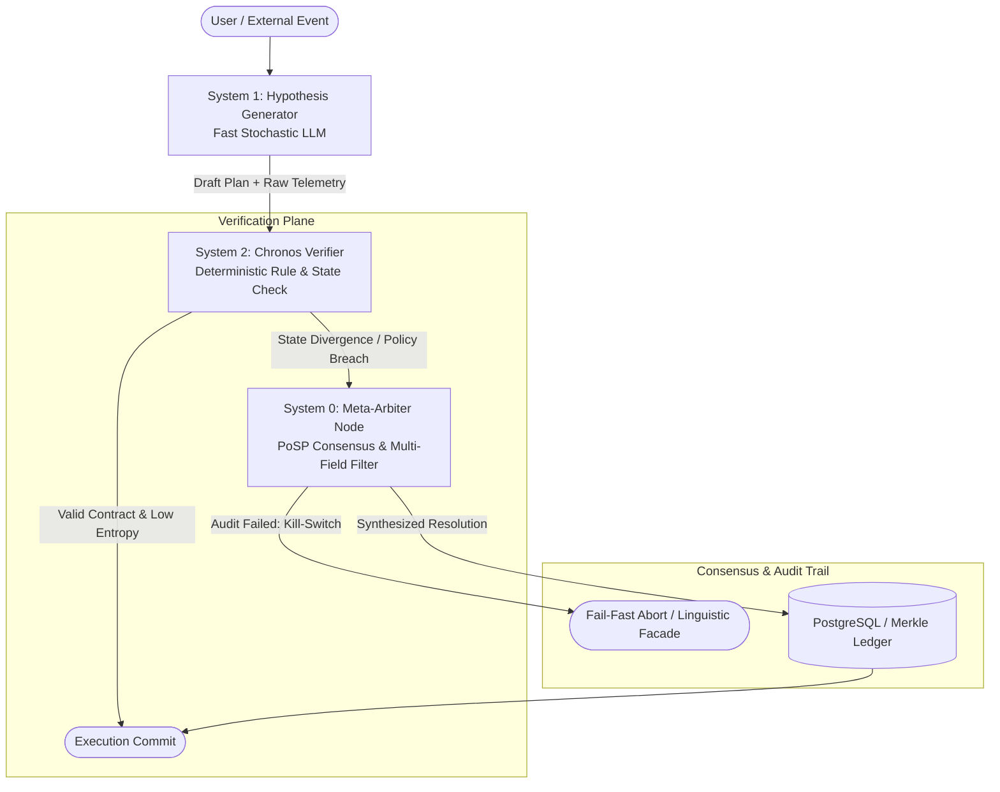

# Chronos V3: Architecture of Conjunctive Transparency (C-T)

[](LICENSE)
[](https://www.python.org/downloads/)
[](#system-topology)
[](#cryptographic-proof--invariants)

Production reference implementation of a **Sovereign Self-Correcting Cognitive System (SCCS)**.

Chronos V3 implements a strict bicameral reasoning architecture: stochastic hypothesis generation (System 1) is decoupled from deterministic, cryptographically signed verification (System 2). Unresolved state divergence is arbitrated via multi-field consensus (System 0), enforcing the **Conjunctive Transparency (C-T)** standard: *claims and empirical proofs are immutable, co-located, and independently verifiable.*

---

## System Topology



---

## Architectural Invariants

* **Bicameral Separation of Concerns:** System 1 generates candidate execution paths. System 2 holds a deterministic zero-hallucination lock, rejecting invalid state transitions before execution rights are committed.
* **Cryptographic Traceability (RFC 8785 & Ed25519):** Every state mutation, verification trace, and arbitration decision is formatted as canonical JSON, signed via Ed25519, and chained into Merkle tree ledgers.
* **Fail-Fast Safety & Containment:** High-entropy divergence triggers an immediate execution abort or drops into a sandboxed Linguistic Facade, blocking unauthorized real-world tool execution.
* **Proof of Sampling (PoSP) Arbitration:** System 0 coordinates consensus across six operational dimensions (Logic, Ethics, Jurisdictional Integrity, Economics, Autonomy, and Anti-Exploitation) to resolve execution ambiguities.

---

## Directory Layout

```text
├── proto/                     # Protocol Buffer contracts (System 1, 2, and 0 interfaces)
├── db/migrations/             # PostgreSQL schema: audit logs, verification hashes, PoSP states
├── lib/chronos_common/        # Shared core: RFC 8785 Canonical JSON, Merkle tree, Ed25519 engine
├── services/
│   ├── system1_generator/     # Fast hypothesis reference service
│   ├── system2_verifier/      # Deterministic validation pipeline (Zero-Hallucination Lock)
│   └── arbiter_node/          # System 0 consensus arbiter (PoSP multi-field engine)
├── docker-compose.yml         # Local multi-service infrastructure (Postgres, Redis, Core Services)
└── Makefile                   # Build automation: protobuf generation, test runners, deployment
```

---

## Quickstart

### 1. Prerequisites

* Python 3.11+
* Docker Compose v2+
* `protobuf-compiler` / `grpcio-tools`

### 2. Generate gRPC Contracts & Install Dependencies

```bash
# Clone the repository
git clone https://github.com/Sega757/Chronos-V3-the-Architecture-of-Conjunctive-Transparency.git
cd Chronos-V3-the-Architecture-of-Conjunctive-Transparency

# Compile protobuf interfaces
make proto
```

### 3. Run Validation Benchmarks & Test Suite

```bash
# Execute unit tests across all verification layers
make test
```

### 4. Deploy Local Stack

```bash
# Spin up PostgreSQL, Redis, and all SCCS services
make up
```

---

## Security & Disclosure

Review [SECURITY.md](SECURITY.md) for vulnerability reporting guidelines and deterministic containment policies.
